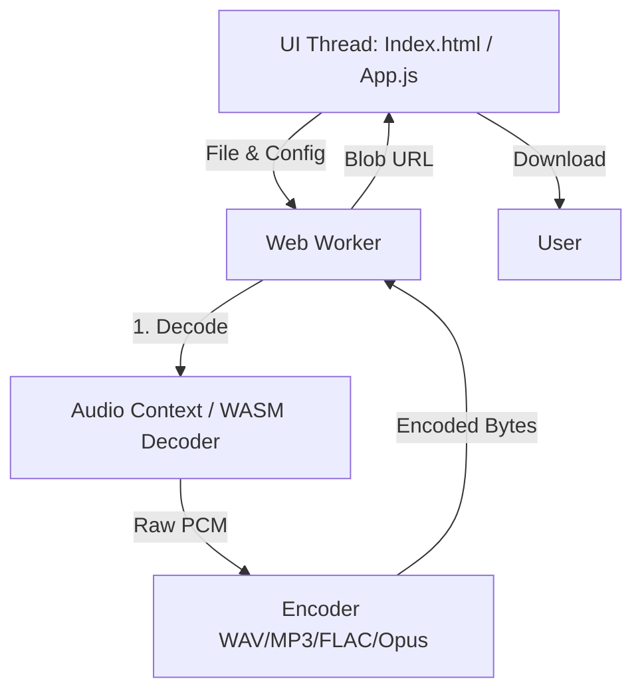

# Brainstorming: Local Audio Encoder/Decoder WebApp

This document outlines the macro design and brainstorming for a free, local-only web application for audio encoding and decoding.

## 1. Project Goals & Constraints
*   **100% Local**: All processing happens in the user's browser. No audio data is uploaded to any server. This ensures privacy and eliminates server hosting costs.
*   **Simple Tech Stack**: Vanilla JavaScript (ES Modules) or TypeScript. No heavy frameworks (React, Vue, etc.). Minimal dependencies.
*   **License Compliant**: Use libraries with licenses compatible with a free web app (e.g., MIT, BSD, Apache 2.0, LGPL). Avoid GPL if we want to keep options open, though GPL is acceptable if the app itself is open-source.
*   **User Friendly**: Simple drag-and-drop interface, clear progress indicators, and easy download links.

## 2. Technical Architecture

A Single Page Application (SPA) utilizing Web Workers to keep the UI responsive during intensive audio processing.

### Key Components:
1.  **UI Thread (`app.js`)**:
    *   Handles file input (drag & drop).
    *   Manages UI state (Selected format, options, progress).
    *   Initiates the Web Worker.
    *   Handles playback of input/output audio (optional, using Web Audio API).
2.  **Web Worker (`audio-worker.js`)**:
    *   Runs in the background to avoid blocking the main thread.
    *   Receives the file as an `ArrayBuffer`.
    *   Decodes the file to raw PCM data.
    *   Passes PCM data to the appropriate encoder.
    *   Sends progress updates back to the UI thread.
    *   Returns the final encoded data as a `Blob`.
3.  **Decoders**:
    *   **Native**: `AudioContext.decodeAudioData` is used for formats the browser natively supports. This is fast and handles MP3, WAV, M4A, OGG (mostly).
    *   **Fallback (Optional)**: If we need to support formats the browser doesn't natively decode (e.g., FLAC on older browsers), we might need a WASM-based decoder. For a "super simple" version, we should rely on native decoding first and limit supported input formats to what the browser supports.
4.  **Encoders**:
    *   **WAV**: Pure JS implementation (easy, raw PCM + header).
    *   **MP3**: LAME WASM or `lamejs` (pure JS). LAME patents have expired, LGPL license.
    *   **FLAC**: `libflac` WASM. BSD license.
    *   **Opus/Ogg**: `libopus` WASM. BSD license.

## 3. Codec & License Strategy

| Format | Role | Implementation | License | Notes |
| :--- | :--- | :--- | :--- | :--- |
| **WAV** | Input/Output | Native Decode / Custom JS Encode | Public Domain | Easiest to implement. Large file sizes. |
| **MP3** | Input/Output | Native Decode / LAME (WASM/JS) Encode | LGPL (LAME) | Patents expired. Good compatibility. |
| **FLAC** | Input/Output | Native Decode (mostly) / libflac WASM | BSD | Lossless compression. |
| **Opus (Ogg)** | Input/Output | Native Decode (mostly) / libopus WASM | BSD | Excellent quality/bitrate ratio. |
| **AAC (M4A)** | Input Only | Native Decode | Patents / Proprietary | Avoid encoding due to licensing complexities. Native decoding is usually supported by the browser. |

### Licensing Considerations:
*   **LAME (MP3)**: LGPL. If we use a pre-compiled WASM binary or a JS port, we are generally compliant as long as we don't statically link it in a way that prevents users from replacing it (not an issue in web/WASM usually, but good to keep in mind). We should provide source links.
*   **libflac / libopus**: BSD licenses are very permissive and safe for this project.

## 4. UI/UX Design (Concept)

A single-page interface divided into three main sections:

1.  **Drop Zone / File Selector**:
    *   Big target for dragging audio files.
    *   Displays info about the loaded file (Name, size, format, duration).
2.  **Configuration Panel**:
    *   Target Format selector (WAV, MP3, FLAC, Opus).
    *   Format-specific options:
        *   *MP3*: Bitrate (CBR/VBR), Quality.
        *   *FLAC*: Compression level.
        *   *Opus*: Bitrate, Application type (VoIP/Audio).
        *   *WAV*: Bit depth (16-bit, 24-bit).
3.  **Action & Progress**:
    *   "Convert" button.
    *   Progress bar with percentage and estimated time remaining.
    *   Result section: Download button, and a simple audio player to preview the result before downloading.

## 5. Implementation Steps (Phased Approach)

*   **Phase 1: Setup & WAV Encoding**
    *   Set up project structure (HTML, CSS, basic JS modules).
    *   Implement file reading and native decoding to `AudioBuffer`.
    *   Implement a simple WAV encoder in JS (directly in the worker).
    *   Verify end-to-end flow: File -> Decode -> WAV Encode -> Download.
*   **Phase 2: MP3 Support**
    *   Integrate LAME WASM encoder.
    *   Add MP3 options to the UI.
    *   Implement MP3 encoding in the worker.
*   **Phase 3: FLAC & Opus Support**
    *   Integrate FLAC and Opus WASM encoders.
    *   Add respective UI options.
*   **Phase 4: UI Refinement & Polish**
    *   Add drag-and-drop support.
    *   Add audio preview player.
    *   Improve styling (responsive design).
    *   Add Service Worker for offline PWA support.
